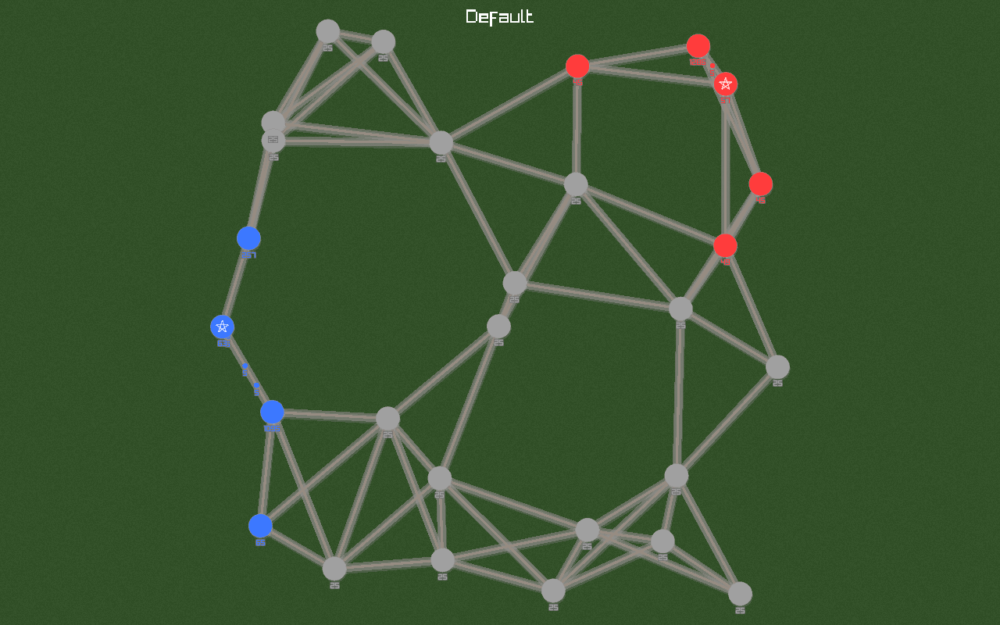
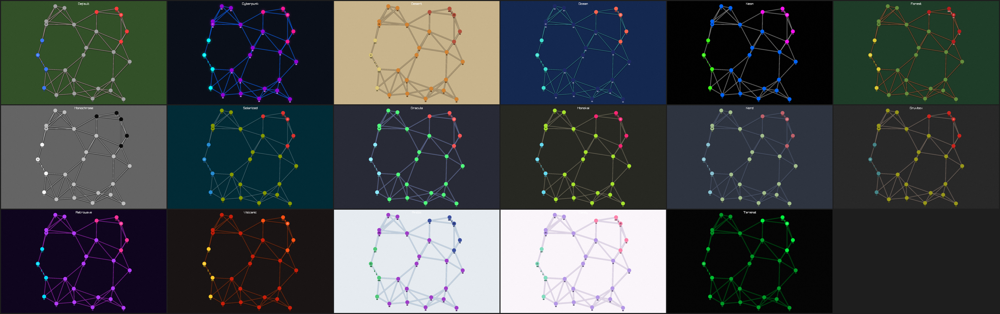

# RiskC++ Strats

A C++ remake of [Risky Strats](https://www.roblox.com/games/4278596942/Risky-Strats) (Roblox) — a real-time strategy game played on geometric graphs. Built as a playable game, a testbed for optimization-based AI, and a headless environment for experiments.





## The game

Players control territory on a randomly generated graph. Nodes produce troops, troops travel along edges (smaller groups move faster), and combat is continuous attrition wherever opposing forces meet. Spend troops to build factories (production), powerplants (boost adjacent producers), forts (defense), and artillery (attack). Last player standing wins.

Full mechanics — tick loop, movement/collision rules, combat math, graph generation, all constants: **[docs/game-rules.md](docs/game-rules.md)**.

## The AI

The interesting part. Instead of end-to-end RL over the raw game, the problem is decomposed into subproblems solved with specialized machinery:

- **Transport** — moving troops to where they're wanted is optimal transport on a graph: a potential-flow (Poisson) solver by default, a warm-started network-simplex min-cost flow with Frank–Wolfe production-saturation in the newer models.
- **Building** — factory/powerplant placement is max-cut-flavored, solved with MCMC annealing and QUBO (Ising) solvers including Goemans–Williamson.
- **Combat** — greedy priority-ordered attack solving with in-flight accounting; the honest control-theoretic formulation is still open.

Bots `v0`–`v12` are registered by name and benchmarked against each other; each version is one deliberate change over its predecessor. Pipeline and model lineage: **[docs/ai.md](docs/ai.md)**. Solver internals: **[docs/solvers.md](docs/solvers.md)**. Subsystem contracts and data flow: **[docs/architecture.md](docs/architecture.md)**.

## Quick start

Requires CMake 3.20+ and a C++20 compiler; RayLib, ImGui/ImPlot, and Eigen are fetched automatically.

```sh
cmake -B build -DCMAKE_BUILD_TYPE=Release
cmake --build build -j

./build/crisky_game                          # spectate AI vs AI
./build/crisky_game --human                  # play against the AI
./build/crisky_game --model=v12 --model=v4   # pick the matchup
./build/crisky_headless 42 10000 v12 v9      # headless benchmark game

for t in build/test_*; do ./$t || exit 1; done   # test suite (17 targets)
```

In-game: hover a node and `Q`/`E`/`R`/`F` to send troops, `1`–`4` to build, `Space` pause, `+`/`-` speed, `[`/`]` themes, `F1` AI debug panels. Full controls and every binary's CLI (gyms, visualizers, tuning, Python experiment suite): **[docs/tools.md](docs/tools.md)**.

## Layout

```
src/engine/         game simulation core (no AI, no rendering)
src/systems/        extracted solvers: economy, transport, ordering, combat, graph_algo
src/ai/             sub-agents, the distribution pipeline, model registry v0–v12
src/gyms/           experiment harnesses for each subsystem
src/apps/           entry points: game, headless, gym binaries, ga_tune, screenshots
src/renderer/ ui/   raylib rendering + human input
src/viz/            ImGui debug panels and overlays
src/observability/  per-tick metrics collection and export
experiments/        Python orchestration (sweeps, Elo tournaments)
docs/               the documentation linked above
PyRisky/            the original Python prototype (reference only)
```
