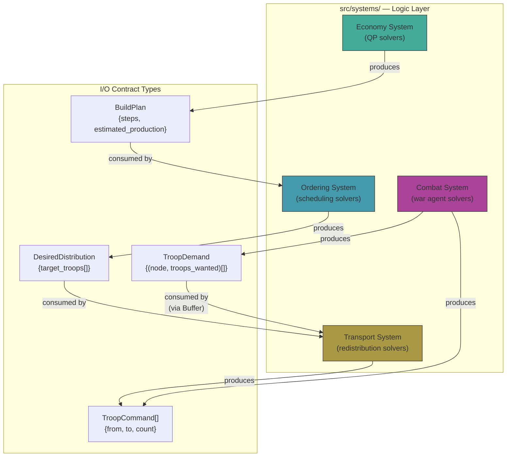
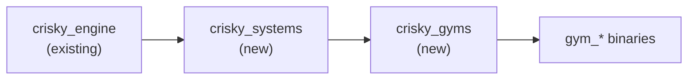
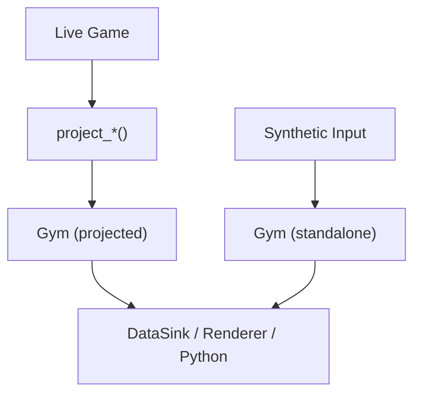

# CRisky Architecture

## Overview

CRisky is a real-time strategy game engine with four decomposable subsystems, each independently testable via "gyms" (experiment harnesses). The game's AI pipeline is a composition of these systems.

## System Decomposition



### I/O Contracts

Systems communicate via explicit types defined in `src/systems/common/types.hpp`:

| From | To | Type | Description |
|------|----|------|-------------|
| Economy | Ordering | `BuildPlan` | Ordered list of (node, structure) pairs + estimated production |
| Ordering | Transport | `DesiredDistribution` | Per-node target troop counts |
| Combat | Transport | `TroopDemand` | Troops demanded at specific frontier nodes |
| Transport | Game | `TroopCommand[]` | Concrete troop movement orders |

Cyclic dependencies (Combat <-> Transport) use `Buffer<T>` for decoupled read/write.

These contracts are extensible: any system output can wire to any system input. New couplings (e.g., traversal order feeding back into build plans) are trivially added.

### Temporal Semantics

Systems are **stateful** -- they evolve over time. At a single timestep, the interface is functional:

```
(State_t, Input_t) → (State_{t+1}, Output_t)
```

But the system carries state across ticks. Gyms expose both standalone (synthetic state) and projected (from live game) modes.

## Folder Layout

```
src/
  engine/          Core game simulation (unchanged)
                   Game, Graph, Combat, EdgeLanes, Production, Routing, Benchmark, GraphBuilder

  systems/         System-specific logic + I/O types (new)
    common/        Buffer<T>, contract types, DataSink (CSV writer)
    economy/       QP solvers: greedy, bootstrap, MCMC (stub), branch-bound (stub)
    ordering/      Scheduling solvers: sequential, cheapest-first, nearest, production-gradient
    combat/        War agent solver typedef (wraps model registry)
    transport/     Redistribution solvers: gradient flow (extracted from attention player)
                   Loss functions: L1, L2, max-deficit

  gyms/            Experiment harnesses (new)
                   economy_gym, ordering_gym, combat_gym, transport_gym
                   combat_benchmarks, projections

  player/          AI composition layer (minor mods)
    players/       AttentionAIPlayer, HumanPlayer, PassivePlayer
    sub_agents/    Economy, Expansion, Bootstrap, Knapsack, DirectWar, FrontierGarrison (new)
    utils/         war_utilities (unchanged, already pure functions)

  renderer/        RayLib visualization (unchanged, extended via overlays in head binaries)
  observability/   Metrics collection + export

experiments/       Python orchestration (new)
notebooks/         Jupyter analysis templates (new)
output/            Experiment CSV data (gitignored)
docs/              This file
```

## Build Dependency Chain



Solver `.cpp` files are compiled into `crisky_engine` (Option A) to avoid circular dependencies with player code. See Deferred Migrations below.

## Gyms: Standalone vs Projection

Each gym can run in two modes:

1. **Standalone**: Synthetic inputs (random graphs, preset benchmarks). For isolated experiments.
2. **Projected**: `project_*(game, player_id)` constructs gym state from a live Game. Same tooling (CSV export, visualization, Python analysis) works on both modes.



## Combat Gym: Dual Transport Modes

The combat gym uses two transport mechanisms with a mask:

- **Aggregation mode**: Gradient flow for strategic troop movement (rear -> frontier). Active for nodes NOT adjacent to enemies.
- **Edge-declarative mode**: Per-edge tactical commands from war agents. Active for nodes adjacent to enemies.

The mask is the existing `scratch_masked_` mechanism in AttentionAIPlayer. Combat-specific AI models use `FrontierGarrisonSubAgent` instead of economy agents (no build noise).

## Desired Config Field (formerly Attention)

The attention field is reconceived as a **desired configuration** (target troop distribution). Sub-agents contribute config deltas. Gradient flow is the transport algorithm: move from current distribution to desired distribution. This unifies the transport gym and the AI's troop flow -- they are the same operation.

## Python <-> C++ Communication

```
Python (experiments/)
  |
  +-- subprocess.run(["gym_combat", "--solver=v4", ...])
  |     -> writes: output/combat/run_001.csv
  |     -> reads:  pd.read_csv(...)
  |
  +-- subprocess.run(["crisky_headless", "--json", ...])
  |     -> stdout: JSONL lines
  |     -> reads:  json.loads(line)
  |
  +-- aggregates DataFrames -> matplotlib -> notebook output
```

Each C++ binary is a standalone Unix tool. Python composes them via subprocess.

---

## Deferred Migrations

1. **Option B library restructure**: Move player code from `crisky_engine` to `crisky_systems`. Engine becomes pure simulation. Blocked on: verifying Option A correctness.
2. **MCMC economy solver**: Stub created. Implementation deferred to experiment phase.
3. **Branch-and-bound economy solver**: Stub created. Deferred.
4. **Flow-based war agent**: Replace knapsack with min-cost flow. Deferred to combat experiments.
5. **Earth-mover loss function**: Requires graph shortest-path computation. Stub created.
6. **pybind11 upgrade**: If subprocess + CSV becomes a bottleneck for interactive Python.
